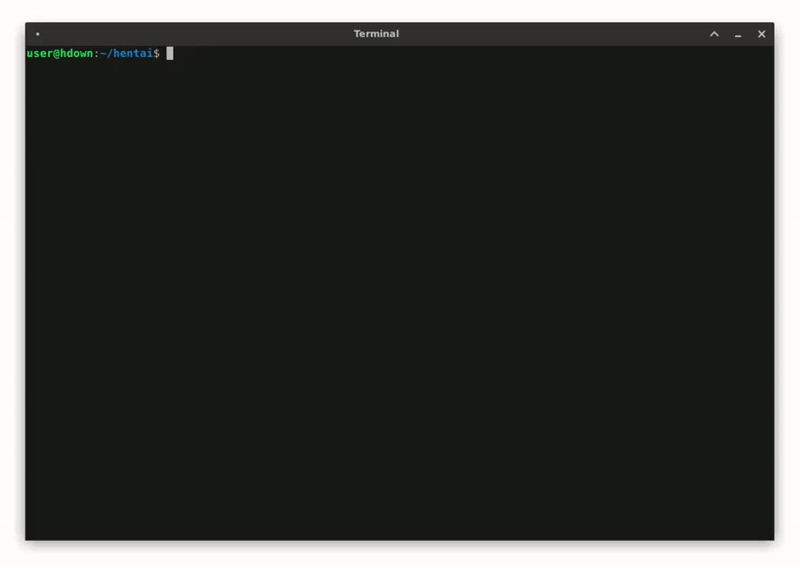

# hdown

<hr style="height : 1px">
<div style="background-color : #161416;">

</div>
<hr style="height : 1px">

[NAME](#NAME)  
[SYNOPSIS](#SYNOPSIS)  
[DESCRIPTION](#DESCRIPTION)  
[OPTIONS](#OPTIONS)  
[USAGE](#USAGE)  
[BUGS](#BUGS)  
[INSTALLING](#INSTALLING)  
[MORE EXPLANATION](#MORE_EXPLANATION)  
[REQUIREMENTS](#REQUIREMENTS)  

## NAME<a name="NAME"></a>

hdown — A simple tool to download images from your favorite doujinshi sites.

<u>**WARNING**</u> : This program can only download JPG or PNG images.

## SYNOPSIS<a name="SYNOPSIS"></a>

**hdown** [<u>OPTIONS</u>]

## DESCRIPTION<a name="DESCRIPTION"></a>

<center>
````
This is a small bash script. Nothing extraordinary.
````
</center>

hdown is a downloading tool that uses **wget** to download images from a doujinshi site. This tool can also download images from any website that uses a certain pattern to store their images. It does not take any arguments since it reads all the required information via the standard input with prompts. (Providing a URL is easier that way and it does not get stored in the history.)

If a site stores their images as : `https://www.some-site.com/images/img001.jpg`, and there are 25 images at the site, all you need to provide the program is the <u>PATTERN</u>, <u>PADDING</u> and <u>PAGES</u>. Some examples of sites that store images in such format would be `hentai2read.com` and `nhentai.net`.

<u>PATTERN</u> — The url till just where the number starts. In the above example, it would be `https://www.some-site.com/images/img`. If there is a slash before the number, you **must** include it in the pattern.

<u>PADDING</u> — The number of digits in the url of the images. In the above example it would be 3, since the index of the images is stored as 001, 002, 011 and similar. If the number of digits is not fixed, like if the numbers are 1, 2, 11 and similar, you need to provide 0.

<u>PAGES</u> — The number of pages to download **starting from** the beginning page. Without the **-p**, **-l** or **-e** options, the images are downloaded from page 1. So if you provide 10 for <u>PAGES</u>, the images will be downloaded till page 10.

You will have to download (give links to the images for) each chapter manually.

<u>**WARNING**</u> : This program will not work if the website has the cloudflare DDoS protection turned on.

## OPTIONS<a name="OPTIONS"></a>

<center>
````
This program does not support long options.
````
</center>

**-h**
<hr style="height : 1px">

Show summary of manual.

**-p**
<hr style="height : 1px">

Start downloading from a custom page number. The <u>PAGE-NUMBER</u> is also taken via the standard input. If **-l** or **-e** is provided, this will have no effect other than the name of downloaded files changing. So use this option with **-l** or **-e** if you want to start naming the files from a certain number. Note that if you give 10 for <u>PAGE-NUMBER</u> and then 10 for <u>PAGES</u>, the images will be downloaded till page 19\. The last page is calculated as : <u>PAGE-NUMBER</u> + <u>PAGES</u> - 1

**-n**
<hr style="height : 1px">

Save the files with a custom name. The <u>NAME</u> is also taken via the standard input. The files will be saved as "<u>NAME PAGE</u>.jpg" (or png, depending on the extension). So, if you provide `Test` for the <u>NAME</u>, the first image will be saved as `Test 1.jpg`, the second image will be saved as `Test 2.jpg` and so on.

**-l**
<hr style="height : 1px">

Download images from `luscious.net`. If this option is provided, the program, instead of the usual <u>PATTERN</u> and <u>PADDING</u>, asks for the <u>URL</u> to the first page (the page from where you want the download to start from). So, if you want to download pages 8-10, you need to provide the <u>URL</u> to the 8th page and 3 for <u>PAGES</u> (8,9,10 — 3 pages). If you want the files named from 8 onwards as well, you **need** to provide the **-p** option.  
**Note that the** <u>URL</u> **is the actual URL to the page and not the URL to the image.**

**-e**
<hr style="height : 1px">

Download images from `e-hentai.org`. If this option is provided, the program, instead of the usual <u>PATTERN</u> and <u>PADDING</u>, asks for the <u>URL</u> to the first page (the page from where you want the download to start from). So, if you want to download pages 8-10, you need to provide the <u>URL</u> to the 8th page and 3 for <u>PAGES</u> (8,9,10 — 3 pages). If you want the files named from 8 onwards as well, you **need** to provide the **-p** option.  
**Note that the** <u>URL</u> **is the actual URL to the page and not the URL to the image.**

<u>**WARNING**</u> : **-l** and **-e** cannot be used together. The first one provided will be considered.

## USAGE<a name="USAGE"></a>

The various options can be combined, except for **-l** and **-e** together.

##### <u>EXAMPLE 1</u>

Suppose you want to download `25` images starting from `https://www.some-site.com/123456/img0003.jpg` (this would mean downloading pages 3-27) and you want the files named as `Test`.

You invoke hdown as :
````
$ hdown -np
````
Now you will be asked to (due to the **-n** option provided) :
````
Enter custom file name :
````
Here, enter the <u>NAME</u> with which you want to save files (explained in the **-n** option section). `Test` for this example.

Now you will be asked to (due to the **-p** option provided) :
````
Enter page no. to start from :
````
Here, enter the <u>PAGE-NUMBER</u> with which you want to save files (explained in the **-p** option section). `3` for this example.

Now you will be asked to :
````
Enter url pattern :
````
Here, enter the <u>PATTERN</u> as explained in the **DESCRIPTION** section. `https://www.some-site.com/123456/img` for this example.

Now you will be asked to :
````
Enter padding of index :
````
Here, enter the <u>PADDING</u> as explained in the **DESCRIPTION** section. `4` for this example.

Now you will be asked to :
````
Enter number of pages :
````
Here, enter the <u>PAGES</u> as explained in the **DESCRIPTION** section. `25` for this example.

That is it. Now the images will be downloaded to the current directory.

##### <u>EXAMPLE 2</u>

Suppose you want to download first 10 images of a particular doujinshi from luscious.net.

You invoke hdown as :
````
$ hdown -l
````

Now you will be asked to :
````
Enter url to the beginning page :
````
Here, enter the <u>URL</u> with which you want to save files (explained in the **-l** option section).

Now you will be asked to :
````
Enter number of pages :
````
Here, enter the <u>PAGES</u> as explained in the **DESCRIPTION** section. `10` for this example.

That is it. Now the images will be downloaded to the current directory.

## BUGS<a name="BUGS"></a>

* The program still creates empty files even if the download failed (this is a problem in **wget** actually).
* The program gets stuck if the server does not respond. This is often encountered when downloading from `e-hentai.org`.

## INSTALLING<a name="INSTALLING"></a>
To install, clone or download this repository and run the following command from the directory :
````
$ sudo ./install
````

If you want to uninstall, use :
````
$ sudo ./uninstall
````

## MORE EXPLANATION<a name="MORE_EXPLANATION"></a>
Suppose you want to download all of a doujinshi from `hentai2read.com`

* Right-click on the image of the first page and click `View Image`
* Copy the url to just before where the index starts.
* Invoke hdown as : `hdown`
* Give the copied url when asked for `Enter url pattern :`
* Give the padding of index when asked for `Enter padding of index :`
* Give the number of pages when asked for `Enter number of pages :`
* Wait for the download to complete and enjoy.

## REQUIREMENTS<a name="REQUIREMENTS"></a>
* wget
* coreutils